# Doge-Studio
Frontend of Doge Studio

## Live Demo: (https://dogestudio.netlify.app/)

- A music player's frontend interface created using **HTML and CSS**. **JQuery** is used on a very limited scale for the carousel's control.
Screenshots are provided below

### Screenshots:

- View-width > 768px

#### Home Page

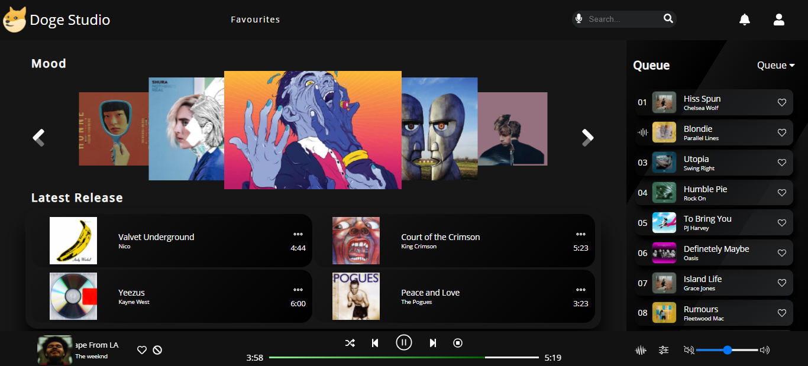

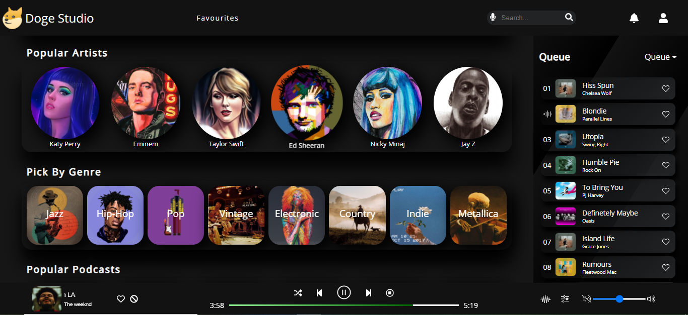

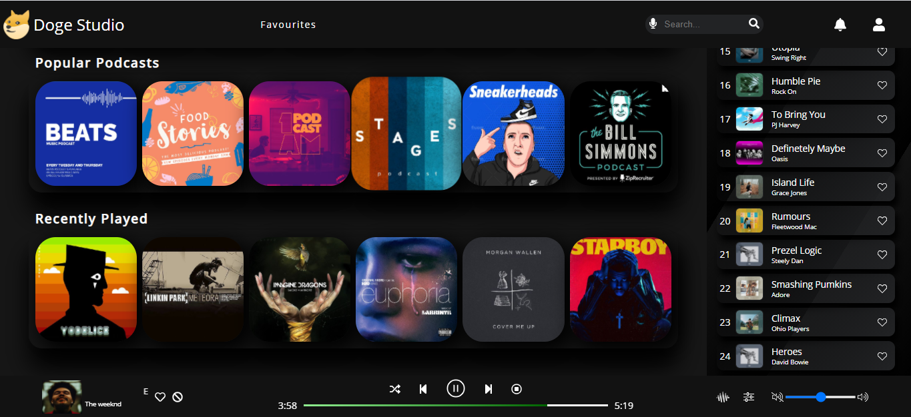

#### Favourites Page

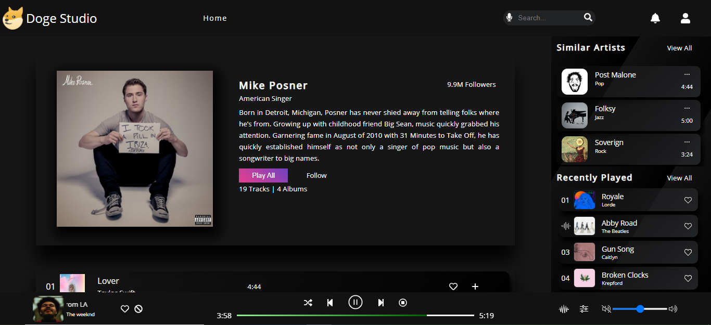

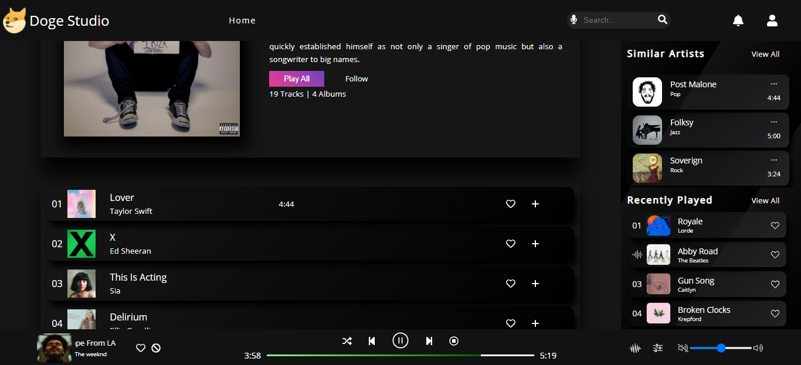

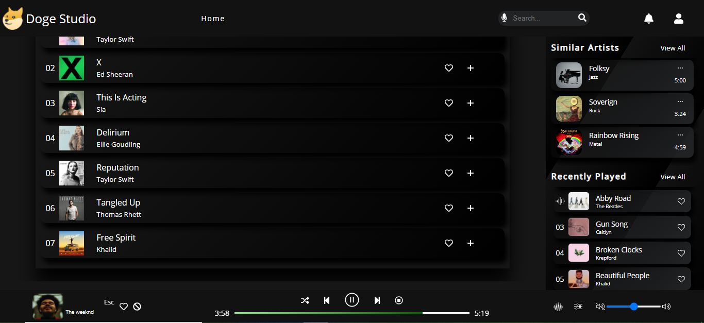

- View-width < 768px

#### Home Page

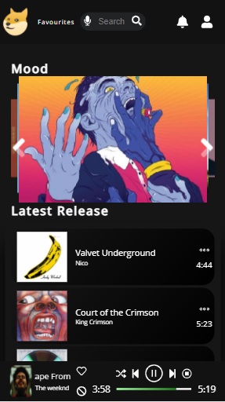

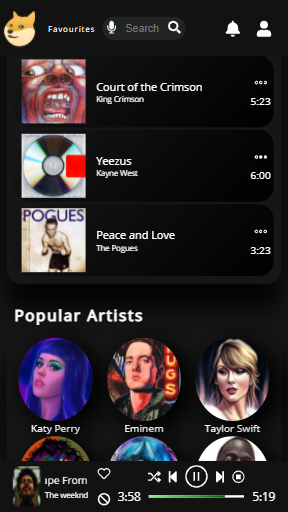

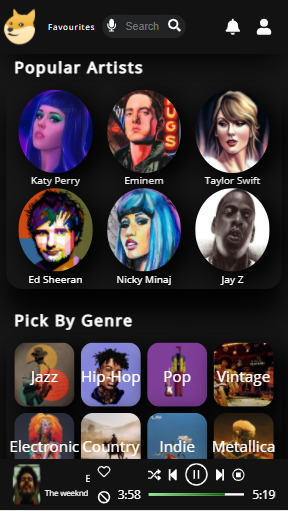

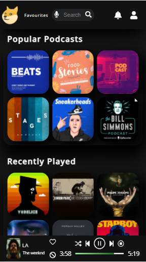

#### Favourites Page

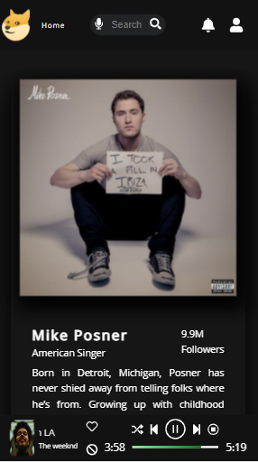

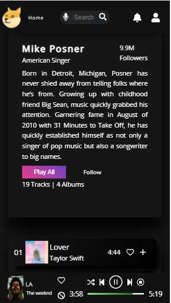

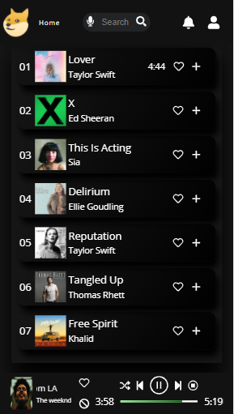

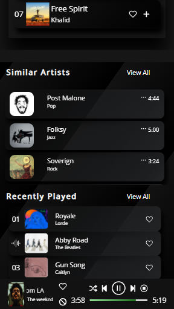
